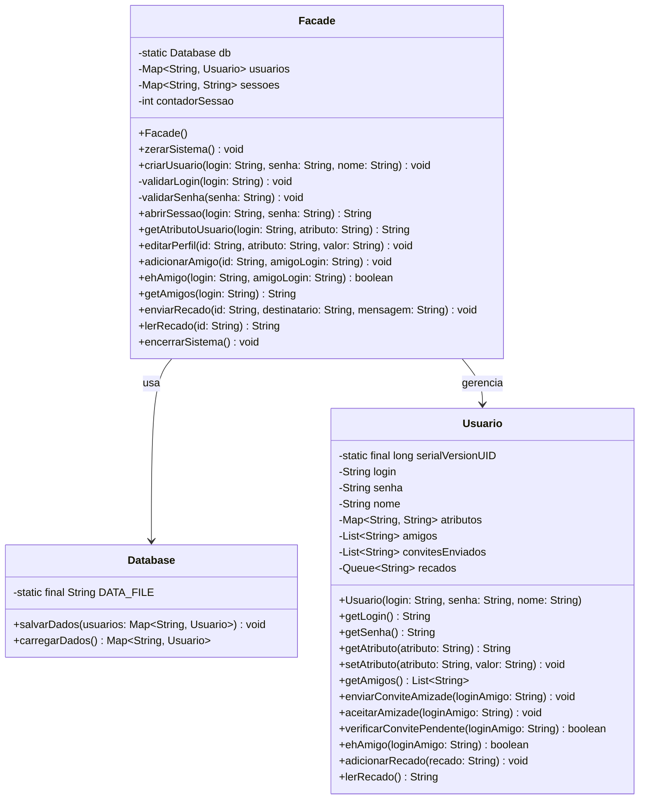

# Entrega - Milestone 1

## Relatório

Como pedido nas especificações do projeto, o sistema foi desenvolvido utilizando o padrão de projeto **Facade**, o qual é utilizado para fornecer uma interface simplificada para um subsistema complexo,

### Classes

A implementação do sistema segue os princípios de encapsulamento e abstração, garantindo que os detalhes internos sejam ocultos dos usuários e que a interface fornecida seja clara e fácil de usar.  

Além disso, o sistema foi projetado para ser extensível, permitindo a adição de novas funcionalidades no futuro sem comprometer a estrutura existente.

Assim sendo, abaixo segue um resumo das principais classes do sistema:
- **Facade**: Classe principal que gerencia a lógica de negócio do sistema,  interagindo com a classe **Database** para persistência de dados e com a classe **Usuario** para manipulação das informações dos usuários.
- **Database**: Classe responsável por salvar e carregar os dados dos usuários em um arquivo, garantindo que as informações sejam mantidas mesmo após o encerramento do sistema. Ela utiliza a serialização para armazenar informações em um arquivo.
- **Usuario**: Classe que representa cada usuário do sistema, armazenando suas informações pessoais, amigos, convites pendentes, recados, etc. Ela possui diversos métodos para manipular esses dados.

> [!NOTE]  
> O relatório em formato `.doc` pode ser encontrado [neste link](https://docs.google.com/document/d/1MKG_iAf1WyufKZPILbJ4sDtHYWviTYY2e4wumGcxqOc/edit?usp=sharing)

## Diagrama de Classes

