# Entrega - Milestone 2

## Relatório

Neste segundo milestone, expandimos o sistema Jackut para incluir funcionalidades das User Stories 5 a 9, mantendo o design baseado no padr?o **Facade** e incorporando novos padr?es de projeto para lidar com a crescente complexidade do sistema.

### Padr?es de Design Utilizados

#### Facade
Continuamos utilizando o padr?o **Facade** como principal interface entre os testes de aceitaç?o e a lógica de negócio. A classe `Facade` foi expandida para incluir novos métodos que implementam as funcionalidades das User Stories 5-9:

- Criaç?o e gerenciamento de comunidades
- Adiç?o de usuários a comunidades
- Envio de mensagens para comunidades
- Criaç?o de novos tipos de relacionamentos (f?-ídolo, paqueras, inimizades)
- Remoç?o de contas de usuário

#### Singleton
Implementamos o padr?o **Singleton** para garantir que certas classes tenham apenas uma instância durante toda a execuç?o do programa:

- `UsuarioService`: Singleton que centraliza todas as operaç?es relacionadas aos usuários
- `ComunidadeService`: Singleton que gerencia todas as operaç?es relacionadas ?s comunidades

Este padr?o nos ajudou a evitar inconsist?ncias nos dados e garantir que os serviços compartilhassem o mesmo estado durante toda a execuç?o do programa.

#### Strategy
Para lidar com os diferentes tipos de relacionamentos (amizade, f?-ídolo, paqueras, inimizades), implementamos o padr?o **Strategy**:

- `RelacionamentoStrategy`: Interface que define o comportamento comum para todos os tipos de relacionamentos
- `AmizadeStrategy`: Implementaç?o específica para relacionamentos de amizade
- `FaIdoloStrategy`: Implementaç?o específica para relacionamentos f?-ídolo
- `PaqueraStrategy`: Implementaç?o específica para paqueras
- `InimizadeStrategy`: Implementaç?o específica para inimizades

A classe abstrata `RelacionamentoStrategyBase` fornece implementaç?es comuns, enquanto as classes concretas implementam comportamentos específicos para cada tipo de relacionamento.

### Novas Classes

#### Comunidades
- `Comunidade`: Representa uma comunidade no sistema, armazenando nome, descriç?o, dono e membros
- `ComunidadeService`: Gerencia todas as operaç?es relacionadas a comunidades

#### Relacionamentos
- `RelacionamentoStrategy`: Interface para estratégias de relacionamento
- `RelacionamentoStrategyBase`: Implementaç?o base para todas as estratégias
- Implementaç?es específicas: `AmizadeStrategy`, `FaIdoloStrategy`, `PaqueraStrategy`, `InimizadeStrategy`
- `RelacionamentoService`: Serviço que coordena todas as estratégias de relacionamento

#### Mensagens
- `MensagemService`: Gerencia o envio de mensagens para comunidades
- `RecadoService`: Serviço aprimorado para gerenciar recados entre usuários

### Principais Funcionalidades Implementadas

#### User Story 5: Criaç?o de comunidades
Implementamos a funcionalidade que permite aos usuários criar comunidades com nome e descriç?o. O criador se torna automaticamente o dono da comunidade.

#### User Story 6: Adiç?o de comunidades
Adicionamos a capacidade de os usuários se adicionarem a comunidades existentes.

#### User Story 7: Envio de mensagens a comunidades
Implementamos o envio de mensagens para comunidades, onde todos os membros recebem a mensagem.

#### User Story 8: Criaç?o de novos relacionamentos
Adicionamos tr?s novos tipos de relacionamentos além da amizade:
- F?-ídolo: Um usuário pode adicionar outro como ídolo e se tornar seu f?
- Paqueras: Usuários podem se adicionar mutuamente como paqueras
- Inimizades: Usuários podem adicionar outros como inimigos, bloqueando interaç?es

#### User Story 9: Remoç?o de conta
Implementamos a funcionalidade que permite aos usuários remover suas contas, eliminando todas as suas informaç?es do sistema.

## Diagrama de Classes

```mermaid
classDiagram
    class Facade {
        +criarComunidade(id: String, nome: String, descricao: String) void
        +getDescricaoComunidade(nome: String) String
        +getDonoComunidade(nome: String) String
        +getMembrosComunidade(nome: String) String
        +adicionarComunidade(id: String, nome: String) void
        +getComunidades(login: String) String
        +enviarMensagem(id: String, comunidade: String, mensagem: String) void
        +lerMensagem(id: String) String
        +adicionarIdolo(id: String, idolo: String) void
        +ehFa(login: String, idolo: String) boolean
        +getFas(login: String) String
        +adicionarPaquera(id: String, paquera: String) void
        +ehPaquera(id: String, paquera: String) boolean
        +getPaqueras(id: String) String
        +adicionarInimigo(id: String, inimigo: String) void
        +removerUsuario(id: String) void
    }
    
    class UsuarioService {
        -static UsuarioService instance
        -Map~String, Usuario~ usuarios
        +getInstance() UsuarioService
        +getUsuario(login: String) Usuario
        +criarUsuario(login: String, senha: String, nome: String) void
        +salvarDados() void
        +carregarDados() void
        +removerUsuario(login: String) void
    }
    
    class Usuario {
        -Map~String, String~ atributos
        -List~String~ amigos
        -List~String~ idolos
        -List~String~ fas
        -List~String~ paqueras
        -List~String~ inimigos
        -Queue~String~ recados
        -Queue~String~ mensagens
        +Usuario(login: String, senha: String, nome: String)
        +adicionarIdolo(idolo: String) void
        +ehIdolo(idolo: String) boolean
        +adicionarFa(fa: String) void
        +ehFa(fa: String) boolean
        +adicionarPaquera(paquera: String) void
        +ehPaquera(paquera: String) boolean
        +adicionarInimigo(inimigo: String) void
        +ehInimigo(inimigo: String) boolean
        +adicionarMensagem(mensagem: String) void
        +lerMensagem() String
    }
    
    class ComunidadeService {
        -static ComunidadeService instance
        -Map~String, Comunidade~ comunidades
        +getInstance() ComunidadeService
        +criarComunidade(login: String, nome: String, descricao: String) void
        +adicionarUsuario(nome: String, login: String) void
        +getComunidade(nome: String) Comunidade
        +enviarMensagemParaComunidade(comunidade: String, mensagem: String) void
    }
    
    class Comunidade {
        -String nome
        -String descricao
        -String dono
        -Set~String~ membros
        +Comunidade(nome: String, descricao: String, dono: String)
        +adicionarMembro(login: String) void
        +getMembros() Set~String~
        +getDono() String
        +getDescricao() String
    }
    
    class RelacionamentoStrategy {
        <<interface>>
        +adicionarRelacionamento(usuarioLogin: String, alvoLogin: String) void
        +verificarRelacionamento(usuarioLogin: String, alvoLogin: String) boolean
        +listarRelacionamentos(usuarioLogin: String) String
    }
    
    class RelacionamentoStrategyBase {
        <<abstract>>
        #UsuarioService usuarioService
        #formatarLista(lista: Collection~String~) String
        #validarAutoRelacionamento(usuarioLogin: String, alvoLogin: String) void
        #validarInimizade(usuario: Usuario, alvo: Usuario) void
        #salvarAlteracoes() void
    }
    
    class AmizadeStrategy {
        +adicionarRelacionamento(usuarioLogin: String, amigoLogin: String) void
        +verificarRelacionamento(usuarioLogin: String, amigoLogin: String) boolean
        +listarRelacionamentos(usuarioLogin: String) String
    }
    
    class FaIdoloStrategy {
        +adicionarRelacionamento(faLogin: String, idoloLogin: String) void
        +verificarRelacionamento(faLogin: String, idoloLogin: String) boolean
        +listarRelacionamentos(usuarioLogin: String) String
    }
    
    class PaqueraStrategy {
        +adicionarRelacionamento(usuarioLogin: String, paqueraLogin: String) void
        +verificarRelacionamento(usuarioLogin: String, paqueraLogin: String) boolean
        +listarRelacionamentos(usuarioLogin: String) String
    }
    
    class InimizadeStrategy {
        +adicionarRelacionamento(usuarioLogin: String, inimigoLogin: String) void
        +verificarRelacionamento(usuarioLogin: String, inimigoLogin: String) boolean
        +listarRelacionamentos(usuarioLogin: String) String
    }
    
    class Database {
        +salvarDados(usuarios: Map~String, Usuario~, comunidades: Map~String, Comunidade~) void
        +carregarDados() Object[]
    }
    
    Facade --> UsuarioService : usa
    Facade --> ComunidadeService : usa
    UsuarioService --> Usuario : gerencia
    ComunidadeService --> Comunidade : gerencia
    RelacionamentoStrategyBase --|> RelacionamentoStrategy
    AmizadeStrategy --|> RelacionamentoStrategyBase
    FaIdoloStrategy --|> RelacionamentoStrategyBase
    PaqueraStrategy --|> RelacionamentoStrategyBase
    InimizadeStrategy --|> RelacionamentoStrategyBase
    UsuarioService --> Database : usa
    ComunidadeService --> Database : usa
```

### Conclus?o

A implementaç?o das User Stories 5-9 seguiu os princípios de design orientado a objetos, utilizando padr?es de projeto como Facade, Singleton e Strategy para criar um sistema modular, extensível e de fácil manutenç?o. A introduç?o de novos tipos de relacionamentos e funcionalidades de comunidades enriqueceu significativamente o sistema Jackut, proporcionando uma experi?ncia mais completa aos usuários.

A persist?ncia de dados foi mantida através do uso do sistema de serializaç?o, garantindo que todas as informaç?es sejam preservadas entre sess?es. Isso inclui comunidades, novos tipos de relacionamentos e mensagens enviadas para comunidades.